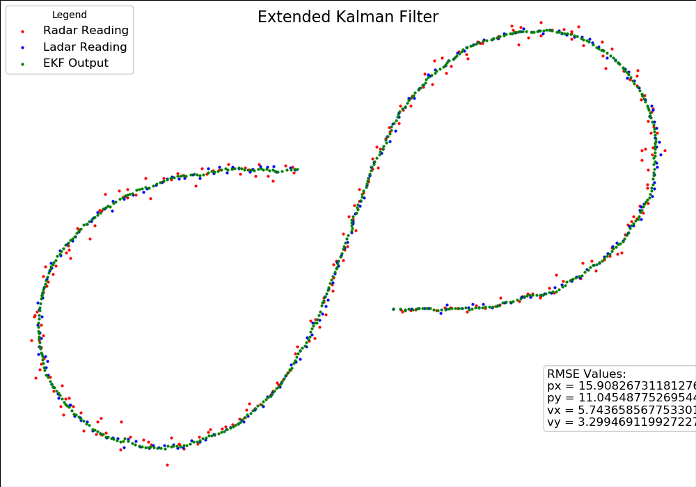

# Extended Kalman Filter Project
Udacity Self-Driving Car Engineer Nanodegree Program

This project utilizes an Extended Kalman Filter to estimate the state of a moving object with noisy lidar and radar measurements. By passing the radar and ladar readings through the Extended Kalman Filter, an output with a higher degree of certainty and also a lower RMSE value when compared to ground truth values was gotten.

This projects depends on the [go num library](https://github.com/gonum/gonum#installation). To install run:

`go get -u gonum.org/v1/gonum/...`

The main program can be built and run by doing the following from the project top directory.

`go run .\main.go`

After passing the sample sensor data through the Extended Kalman Filter, the result can be simulated by running the `display.py` python script from the same directory, using the command:

`python display.py`

You will get an output similar to this:

If you'd like to generate your own radar and lidar data, see the
[utilities repo](https://github.com/udacity/CarND-Mercedes-SF-Utilities) for
Matlab scripts that can generate additional data.
